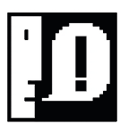

<nav class="top-nav">
  

    <a href="/" class="logo">Colin Burke</a>
    

      <a href="/" class="active">Home</a>
      <a href="/portfolio.html">Portfolio</a>
      <a href="/games.html">Games</a>
      <a href="/projects.html">Projects</a>
      <a href="/techblog.html">Tech Blog</a>
      <a href="/aboutme.html">About</a>
      <a href="/itconsulting.html">Hire Me</a>
    

    <button class="mobile-menu-toggle">☰</button>
  

</nav>

  

    <h1 style="font-size: 2.5rem; margin-bottom: 0.5rem; color: var(--primary-blue);">Colin Burke</h1>
    
Bringing ideas to life through learning and experimentation

    

      Python Specialist
      Game Developer
      Music Technology
      Cloud Engineer
    

  

  

    <a href="/portfolio.html">📁 Portfolio</a>
    <a href="/games.html">🎮 Games</a>
    <a href="/projects.html">🔧 All Projects</a>
    <a href="/techblog.html">📝 Tech Blog</a>
    <a href="/aboutme.html">👨‍💻 About Me</a>
    <a href="/itconsulting.html">💼 Hire Me</a>
  

  <section style="margin: 1.5rem 0;">
    <h2>🚀 What I'm Building</h2>
    
Currently working on game development, music technology, and Python automation tools. Each project explores new challenges and learning opportunities.

    

      
<strong>Active across multiple domains</strong> • <strong>Regular development</strong> • <strong>Open source contributor</strong>

    

  </section>

  <section style="margin: 1.5rem 0;">
    <h2>🔗 Explore My Work</h2>
    

      

        
        <h3>🎮 Critacle Games</h3>
        
Gaming division creating immersive experiences from RPGs to music games. Play on Itch.io and GX.games platforms.

        

          <a href="./games.html">Explore Games</a>
        

      

      

        
        <h3>Browse All Projects</h3>
        
Detailed breakdown of my recent game development, music technology, and Python tools with technical specifications and implementation details.

        

          <a href="./projects.html">View All Projects</a>
        

      

      

        
        <h3>Development Blog</h3>
        
Deep-dives into project implementation, technical challenges, and lessons learned from real development work and problem-solving.

        

          <a href="./techblog.html">Read Articles</a>
        

      

      

        
        <h3>About Me</h3>
        
My background, what drives my development journey, the story behind the projects, and my technical philosophy.

        

          <a href="./aboutme.html">Learn More</a>
        

      

      

        
        <h3>Professional Services</h3>
        
Custom development, automation solutions, and technical consulting for your projects and business needs.

        

          <a href="./itconsulting.html">Get in Touch</a>
        

      

    

  </section>

  <section style="margin: 1.5rem 0;">
    <h2>🎨 My Focus Areas</h2>
    

      

        <h4>🎮 Game Development</h4>
        <ul>
          <li>Dragon Quest-style RPGs</li>
          <li>Game management tools</li>
          <li>Interactive experiences</li>
          <li>GameMaker Studio 2</li>
        </ul>
      

      

        <h4>🎵 Music Technology</h4>
        <ul>
          <li>AI music generation</li>
          <li>Audio processing tools</li>
          <li>Guitar transcriptions</li>
          <li>MIDI and sound design</li>
        </ul>
      

      

        <h4>🐍 Python Development</h4>
        <ul>
          <li>Automation scripts</li>
          <li>Web applications (Flask)</li>
          <li>Data processing</li>
          <li>Desktop applications</li>
        </ul>
      

      

        <h4>☁️ Cloud & Infrastructure</h4>
        <ul>
          <li>Google Cloud Platform</li>
          <li>System automation</li>
          <li>Migration planning</li>
          <li>Performance optimization</li>
        </ul>
      

    

  </section>

  

    <h2>Ready to Connect?</h2>
    
"Filled with determination - Techie who has always been a little ahead of the curve. I love prototyping ideas in Python and playing with musical logic."

    

      <a href="/portfolio.html" class="primary">View Portfolio</a>
      <a href="/itconsulting.html" class="secondary">Work Together</a>
    

  

